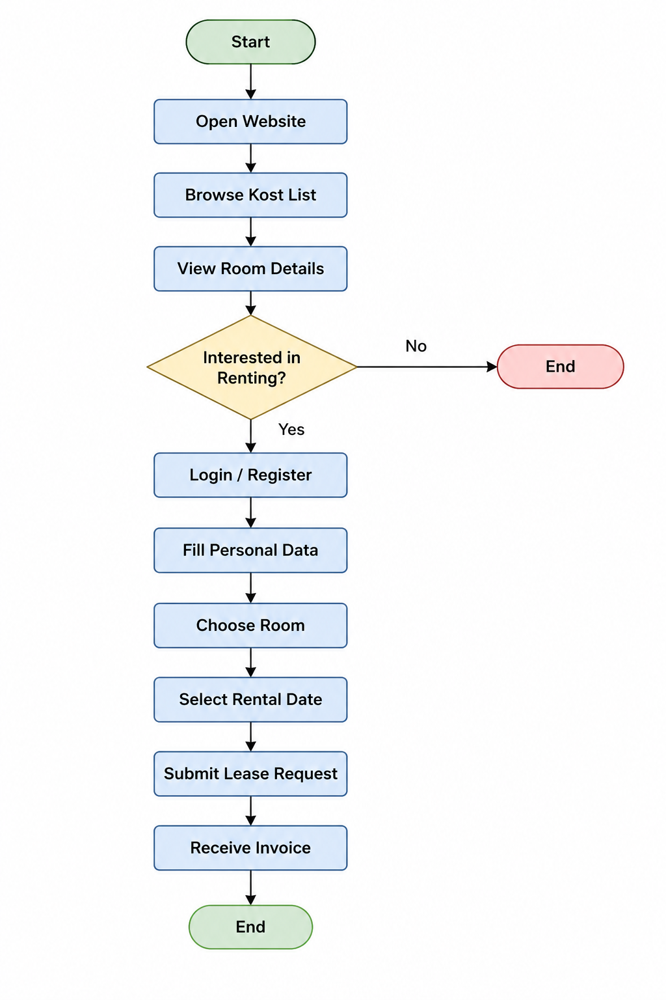
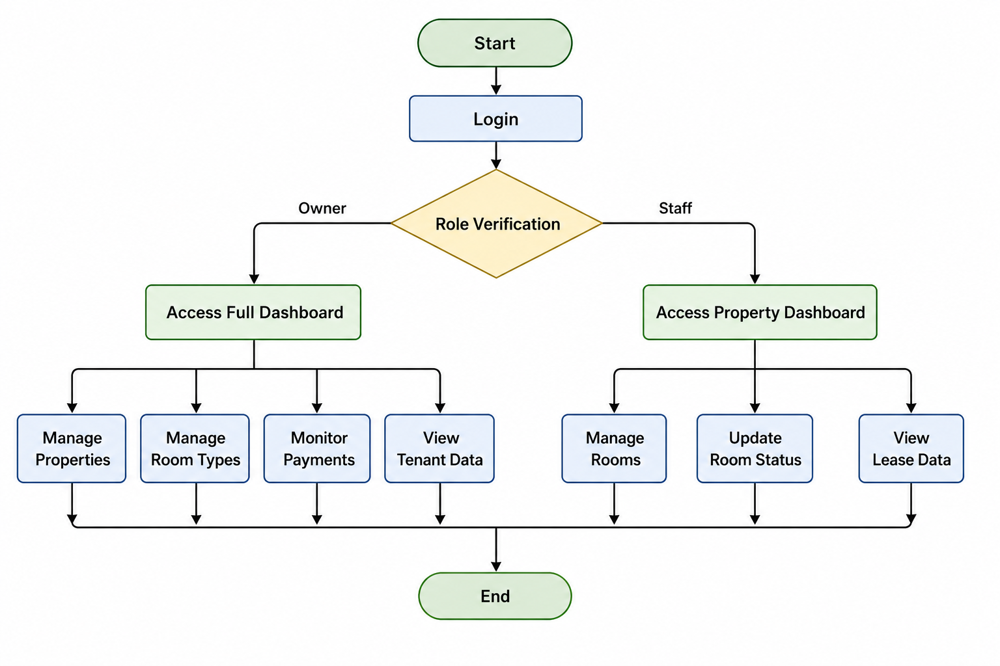

# IBDA Kost Management System

## Overview

IBDA Kost Management System adalah aplikasi berbasis web untuk membantu pengelolaan usaha kos secara terstruktur, efisien, dan terpusat.

Sistem ini dirancang untuk:

* Menampilkan informasi kos dan kamar kepada calon penyewa
* Mengelola data kamar dan tipe kamar
* Mengatur status ketersediaan kamar
* Mengelola data penyewa dan proses penyewaan
* Membantu pengelolaan laporan pembayaran dan operasional kos

Backend sistem menggunakan Django dan database PostgreSQL dari Supabase.

---

# Business Understanding

## Latar Belakang

IBDA Kost merupakan usaha penyewaan kamar hunian yang memiliki tiga lokasi berbeda. Setiap lokasi memiliki 10 kamar dengan tipe dan fasilitas yang berbeda.

Jenis kamar dibedakan menjadi empat kategori:

| Tipe   | Ukuran      | Fasilitas                                            | Harga       |
| ------ | ----------- | ---------------------------------------------------- | ----------- |
| Tipe 1 | 2.5m × 2.5m | Kipas angin, kamar mandi luar                        | Rp750.000   |
| Tipe 2 | 3m × 3m     | Kamar mandi dalam                                    | Rp1.250.000 |
| Tipe 3 | 4m × 4m     | AC, TV, dispenser, kamar mandi dalam                 | Rp2.250.000 |
| Tipe 4 | 5m × 5m     | AC, TV, mini pantry, dispenser, kulkas, parkir mobil | Rp3.750.000 |

Sebelumnya, pengelolaan data kamar dan penyewa masih dilakukan secara manual sehingga menyebabkan:

* Informasi kamar tidak terpusat
* Status kamar tidak selalu diperbarui
* Kesalahan informasi ketersediaan kamar
* Sulit melakukan monitoring data penyewa dan pembayaran

Karena itu, dibutuhkan sistem berbasis website yang mampu membantu pengelolaan data secara lebih efisien dan terorganisir.

---

# Main Features

## Fitur User

* Melihat daftar kos
* Melihat detail kamar
* Melihat fasilitas dan harga kamar
* Melihat lokasi kos
* Melakukan pengajuan penyewaan kamar
* Mengisi data identitas diri

## Fitur Pengelola

* Mengelola data kos
* Mengelola data kamar
* Memperbarui status kamar
* Mengelola data penyewa
* Mengelola data sewa
* Melihat laporan pembayaran

---

# User Roles

## 1. Pelanggan

Hak akses:

* Browse daftar kos
* Melihat daftar kamar
* Melihat detail tipe kamar
* Melakukan penyewaan kamar

## 2. Owner

Hak akses:

* Melihat seluruh data sistem
* Mengelola data properti kos
* Mengelola tipe kamar
* Monitoring penyewa
* Monitoring pembayaran

## 3. Staff

Hak akses:

* Mengelola kamar pada lokasi tertentu
* Update status kamar
* Melihat data penyewa pada lokasi yang dijaga

---

# Authentication & Security

## Login System

Sistem menggunakan mekanisme autentikasi berbasis role.

### Security

* Password disimpan dalam bentuk hash
* Password tidak disimpan dalam bentuk plain text
* Sistem melakukan verifikasi hash saat login

---

# Database Design

## Entity Utama

* users
* properties
* rooms
* room_types
* leases
* invoices

## Catatan Status Kamar

Status kamar dipisahkan menjadi:

* tersedia / tidak tersedia
* terisi / tidak terisi

Hal ini diperlukan karena:

* kamar dapat tidak tersedia akibat maintenance
* kamar dapat kosong tetapi belum siap disewakan

---

# CRUD Features

## Data yang Dikelola

* Data pelanggan
* Data pengelola
* Data kos
* Data kamar
* Data tipe kamar
* Data invoice
* Data penyewaan

---

# System Flowchart

## User Flow



---

## Manager / Staff Flow




---

# Technology Stack

## Backend

* Django
* Django REST Framework

## Database

* PostgreSQL
* Supabase

## Frontend

* HTML
* CSS
* JavaScript

## Deployment

* Railway / Render
* Supabase Database

---

# API & System Architecture

```text
Frontend Client
       |
       v
Django Backend API
       |
       v
PostgreSQL (Supabase)
```

---

# Future Improvements

* Online payment integration
* WhatsApp notification
* Room booking system
* Monthly billing automation
* Analytics dashboard
* Maintenance request system

---

# Setup Installation

## Clone Repository

```bash
git clone <repository-url>
cd ibda-kost
```

## Create Virtual Environment

```bash
python -m venv env
```

## Activate Virtual Environment

### Windows

```bash
env\Scripts\activate
```

### Linux / macOS

```bash
source env/bin/activate
```

## Install Dependencies

```bash
pip install -r requirements.txt
```

## Configure Environment Variables

Buat file `.env`

```env
SECRET_KEY=your-secret-key
DEBUG=True
DATABASE_URL=your-supabase-database-url
```

## Run Migration

```bash
python manage.py migrate
```

## Run Server

```bash
python manage.py runserver
```

---

# Deployment

## Backend Deployment

Backend dapat dideploy menggunakan:

* Railway
* Render
* VPS Ubuntu

## Database

Menggunakan PostgreSQL dari Supabase.

---

# Contributors

1. Gracia Naimora Samosir - IBDA (222100986)
2. Joshua Calvin Siahaan - IBDA (222200129)
3. Filbert Jonathan - IBDA (222200365)
4. Josh Gibran Candlerson - IBDA (242301743)

---

# License

This project is developed for academic and learning purposes.
